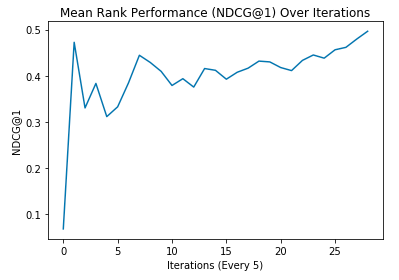

# DeepQRank: Generating Search Engine Rankings with Deep Reinforcement Learning

Learning to Rank is the problem involved with ranking a sequence of documents based on their relevance to a given query. Deep Q-Learning has been shown to be a useful method for training an agent in sequential decision making.

DeepQRank, our deep q-learning to rank agent, demonstrates performance that can be considered state-of-the-art. Though less computationally efficient than a supervised learning approach such as linear regression, our agent has fewer limitations in terms of which format of data it can use for training and evaluation.

Here's how the model improves over time:

We run our algorithm against Microsoft's LETOR listwise dataset and achieve an NDCG@1 (ranking accuracy in the range [0,1]) of 0.5075, narrowly beating out the leading supervised learning model, SVMRank (0.4958).

As this table shows, our model has the highest NDCG@1 (a ranking metric used for document relevance).

| Model         | NDCG@1  |
|---------------|---------|
| RankSVM       | 0\.4958 |
| ListNet       | 0\.4002 |
| AdaRank\-MAP  | 0\.3821 |
| AdaRank\-NDCG | 0\.3876 |
| SVMMAP        | 0\.3853 |
| RankNet       | 0\.4790 |
| MDPRank       | 0\.4061 |
| **DeepQRank**     | **0\.5075** |

## How to Run
The scripts folder has multiple scripts for training and evaluating a model. To modify the neural network being used, you can edit the model/dqn.py file. The dataset needed for this model is LETOR's listwise dataset.
